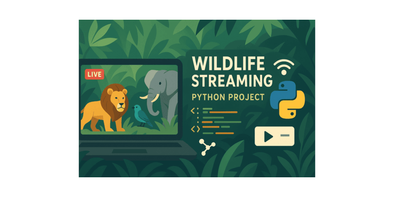

# Wildlife Streaming E2E



A personal project that demonstrates a complete end-to-end streaming setup—from data generation and ingestion to warehousing, transformation, and interactive visualization.

## Overview
Wildlife Streaming E2E simulates animal movement and tracking-collar events, streams them through a Kafka-compatible broker, captures database changes with Debezium, lands and models them in a ClickHouse data warehouse using dbt (orchestrated by Dagster), and exposes metrics and trails via a Streamlit dashboard.

This includes:
* Synthetic wildlife entities (animals, trackers, events) generated on a schedule
* Change Data Capture (CDC) from Postgres to ClickHouse via Debezium
* Transformations and marts built with dbt, orchestrated by Dagster
* A Streamlit app for real-time metrics and historical movement visualization

```bash
.
├─ backend/               # Simulator, API, models, Posgres DB
├─ kafka/                 # Debezium + connector templates/scripts, sink registry
├─ clickhouse/            # DDL/warehouse setup
├─ dbt/                   # dbt project
├─ orchestrator/          # Dagster project
├─ frontend/              # Streamlit app
├─ assets/
├─ Makefile
├─ docker-compose.yml
└─ pyproject.toml         # master pyproject for development, including linter and formatting
```

### [Backend & Data Simulator](./backend)
Pythonic simulator to generate data about wildlife animals and tracking collars.
The simulator runs:
* A spawn cycle per every `LIFECYCLE_UPDATE_INTERVAL_SECONDS` seconds, to create new and remove expired ones.
* A move cycle per every `MOVE_INTERVAL_SECONDS` seconds, to simulate animal movements.

- `server/` – REST endpoints and application bootstrap.
- `simulator/` – utilities for generating synthetic animal spawning and movements.
- `models/` – Pydantic models for animals, trackers, and events.

The backend pushes data to Kafka, ready for further processing.

Stacks:
- Postgres DB
- Adminer: Browser UI

These parameters below in [app setting](backend/settings.py) could be tweaked:

| Parameter                           | Value                      | Description                                  |
| ----------------------------------- | -------------------------- | -------------------------------------------- |
| `NP_REGION`                         | Central Highlands, Vietnam | Name / location of the protected area        |
| `NP_LAT_RANGE`                      | (12.5 °, 14.0 °)           | Minimum & maximum latitudes                  |
| `NP_LON_RANGE`                      | (107.0 °, 108.5 °)         | Minimum & maximum longitudes                 |
| `ANIMAL_LIMIT`                      | 50                         | Maximum concurrent animals in the simulation |
| `LIFECYCLE_UPDATE_INTERVAL_SECONDS` | 60 s                       | Time between spawn cycles                    |
| `SPAWN_NR`                          | 5                          | Animals spawned per cycle                    |
| `MOVE_DELTA`                        | 0.2 km                     | Distance each animal moves per update        |
| `MOVE_INTERVAL_SECONDS`             | 15 s                       | Time between movement updates                |


### [Streaming Layer](./kafka)
Kafka Connect and Debezium configuration for change data capture from Postgres Backend DB to Clickhouse Data Warehouse Solution.

- `Dockerfile.debezium` – builds Debezium connector image.
- `scripts/` – helper scripts to register connectors.
- `templates/` – JSON templates for connectors and ClickHouse sinks.

Stacks:
- **Redpanda (`redpanda`)** – Kafka-compatible message broker.
- **Redpanda Console (`redpanda-console`)** – web UI for Redpanda topics.
- **Debezium (`debezium`)** – change data capture connector for streaming Postgres updates.
- **Debezium UI (`debezium-ui`)** – interface to manage Debezium connectors.
- **kafka-connector-registry** - Register sinks and connectors on startup

### [Data Warehouse]
Analytics pipeline that cleans CDC messages, builds foundational models, and exposes a data mart for the frontend.

- `.dbt\` - dbt project for data transformation, warehouse and mart building
- `.orchestrator\` - dagster projects for dbt orchestration
- `.clickhouse\` - clickhouse data warehouse, creates databases, roles, and landing tables.

### [Streamlit Frontend](./frontend)
Streamlit app to expose metrics and historical movements of animals via dashboards

- `pages/` – home, summary, trail, and event log views.
- `utils/` – shared helper functions e.g. db functions
- `main.py` – navigation entry point.

## Getting Started
### Prerequisites

* Docker and Docker Compose
* Python 3.11+
* uv (Python package & venv manager)
* make (for common workflows)
* (For Development) pre-commit

### Installation

```bash
# 1) Install uv

# 2) Create a new venv and sync
uv venv
source .venv\bin\activate\
uv sync

# 3) Install pre-commit
pre-commit install
```

### Local Development

| Command      | Description                                       |
| ------------ | ------------------------------------------------- |
| `make build` | Build images, prepare local resources/connectors  |
| `make start` | Start all local services (broker, DBs, UIs, apps) |
| `make stop`  | Stop all services                                 |
